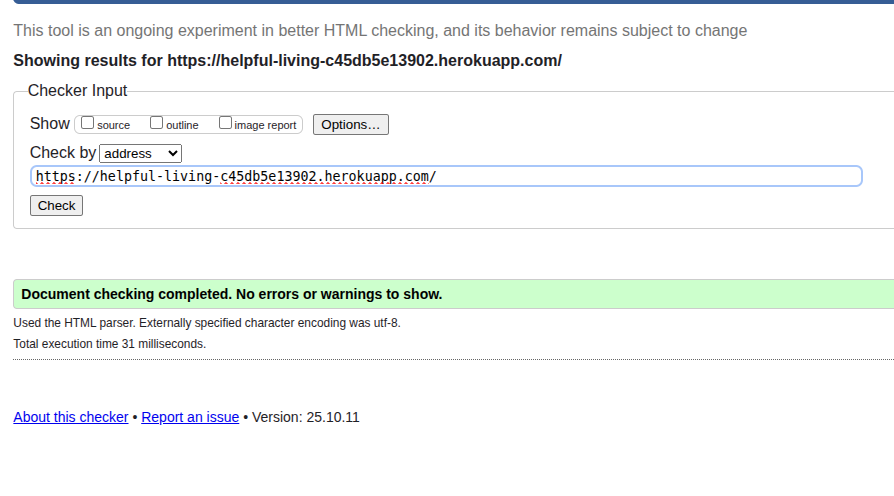

# [Helpful Living](https://helpful-living-c45db5e13902.herokuapp.com/)

Welcome to Helpful Living. Here at Helpful Living, we aim to help you live your life a little more easily. Whether you are in need of your house being cleaned, getting the weekly shop in, or just want someone to come with you for a coffee, we are here to help.

Through our website, you will be able to book in for an initial consultant call to see how we can best provide for your needs, and after that you will be able to log on to track, edit or cancel your future appointments. We aim to make this experience as simple as possible for you, and to keep all lines of communication open for any further help you may need.


## To visit the deployed site, visit <a href="https://helpful-living-c45db5e13902.herokuapp.com/" target="_blank">here</a>.

## CONTENTS

- [User Experience](#user-experience-ux)

  - [User Stories](#user-stories)

- [Design](#design)

  - [Colour Scheme](#colour-scheme)
  - [Typography](#typography)
  - [Imagery](#imagery)
  - [Entity Relationship Diagram](#entity-relationship-diagram)
  - [Wireframes](#wireframes)

- [Features](#features)

  - [Main Features](#main-features)
  - [General Features on Each Page](#general-features-on-each-page)
  - [Responsivity of pages](#responsivity)
  - [Future Implementations](#future-implementations)

- [Technologies Used](#technologies-used)

  - [Languages Used](#languages-used)
  - [Frameworks, Libraries & Programs Used](#frameworks-libraries--programs-used)
  - [AI Use](#ai-use)

- [Deployment & Local Development](#deployment--local-development)

  - [Deployment](#deployment)
  - [Local Development](#local-development)
    - [How to Fork](#how-to-fork)
    - [How to Clone](#how-to-clone)

- [Bugs](#bugs)

- [Testing](#testing)
  _[Lighthouse](#lighthouse)
  _[Code Validation](#code-validation)
  _[HTML](#html)
  _[CSS](#css)
  _[JavaScript](#javascript)
  _[Manual Testing](#manual-testing)

- [Credits](#credits)
  - [Code Used](#code-used)
  - [Acknowledgments](#acknowledgments)

---

## User Experience (UX)

### User Stories

| Title                         | User Story                                                                                                                                       | Acceptance Criteria                                                                                                                                                                                                                                                                                                                                                               | Tasks                                                                                                                                                                                                                                                                                                                                                                                                                                                                                                 |
| :---------------------------- | :----------------------------------------------------------------------------------------------------------------------------------------------- | :-------------------------------------------------------------------------------------------------------------------------------------------------------------------------------------------------------------------------------------------------------------------------------------------------------------------------------------------------------------------------------- | :---------------------------------------------------------------------------------------------------------------------------------------------------------------------------------------------------------------------------------------------------------------------------------------------------------------------------------------------------------------------------------------------------------------------------------------------------------------------------------------------------- |
| **Accounts System**           | As a **potential customer**, I want to **create an account, log in and see that I’m logged in** so that I can **track my bookings**.             | <ul><li>A clear registration form collects and securely validates a new user’s name, email, phone number and password.</li><li>A login form allows an existing user to sign in with their credentials.</li><li>Once logged in, the user’s status is visible in the navigation (e.g. “Hello, &lt;name&gt;!”)</li><li>A “Log Out” option is available to end the session.</li></ul> | <ul><li>Set up **Django’s authentication system** and a custom user model.</li><li>Create Django views and forms for user registration and login.</li><li>Update the base HTML template to display conditional navigation links for logged-in and logged-out users.</li></ul>                                                                                                                                                                                                                         |
| **Landing Page**              | As a **new visitor**, I want to **visit a welcoming landing page that tells me about the business** so that I can **understand what you offer**. | <ul><li>The landing page displays a clear welcome message and a summary of your services.</li><li>The page is visually appealing and easy to navigate.</li><li>It contains links to other key pages, such as "Services," "Gallery," and "Login/Register."</li></ul>                                                                                                               | <ul><li>Create a **core app** in Django.</li><li>Write a view to render the landing page.</li><li>Design the `landing_page.html` template.</li><li>Set up the URL path for the homepage (`/`).</li></ul>                                                                                                                                                                                                                                                                                              |
| **Booking System**            | As a **logged-in user**, I want to **book a 20-minute consultation** so I can **schedule my first appointment**.                                 | <ul><li>A "Book" button on the services page or a dedicated booking page leads to a consultation form.</li><li>The form allows the user to select a date and an available time slot.</li><li>The system creates a new booking record linked to the user's account.</li></ul>                                                                                                      | <ul><li>Create a **Booking model** linked to the **User model**.</li><li>Implement a Django form for the booking process.</li><li>Build a view to handle the booking form submission.</li></ul>                                                                                                                                                                                                                                                                                                       |
| **Services Page**             | As a **potential customer**, I want to **see a page with a list of services** so I can **find out more information about your offerings**.       | <ul><li>The "Services" page is accessible from the navigation.</li><li>It displays each service as a visually distinct card with a title, a brief description, and an image.</li><li>Clicking on a service card leads to a separate page with more detailed information about that service.</li></ul>                                                                             | <ul><li>Create a services app and a **Service model**.</li><li>Write a Django view to fetch all Service objects for the main page.</li><li>Design the `service_list.html` template for the cards page.</li><li>Create a separate view and template for the individual service detail page.</li></ul>                                                                                                                                                                                                  |
| **Gallery**                   | As a **potential customer**, I want to **browse a gallery of past work** so I can **see examples of your services in action**.                   | <ul><li>A dedicated "Gallery" page is available from the navigation.</li><li>The page displays images in a grid format.</li><li>Clicking on an image opens a larger, more detailed view within a lightbox.</li></ul>                                                                                                                                                              | <ul><li>Create a **GalleryImage model** to store image details.</li><li>Implement a view to fetch all images from the database.</li><li>Design the `gallery.html` template and integrate a JavaScript lightbox library.</li></ul>                                                                                                                                                                                                                                                                     |
| **Notifications System**      | As a **logged-in user**, I want to **receive notifications about my appointments** so that **I am always up to date on changes and updates**.    | <ul><li>A notification badge appears in the navbar, showing the number of unread messages.</li><li>Clicking the badge reveals a pop-up with a list of the last few notifications.</li><li>Read notifications are visually distinguished from unread ones (e.g. greyed out).</li><li>The pop-up has a "See All" button that links to a full notifications page.</li></ul>          | <ul><li>Create a **Notification model** linked to the **User model**.</li><li>Build a Django view that returns the latest notifications from the database, filtered by the logged in user.</li><li>Use **JavaScript** on the frontend to fetch and render the notifications in a dynamic pop-up.</li></ul>                                                                                                                                                                                            |
| **Contact Form**              | As a **visitor**, I want to **send a message** so I can **ask a question about your services**.                                                  | <ul><li>A simple contact form is available on a "Contact" page.</li><li>The form collects a name, email, and a message.</li><li>Upon submission, the message is sent to the site administrator's email address.</li></ul>                                                                                                                                                         | <ul><li>Create a **Django form** for the contact messages.</li><li>**Configure the Django email backend** in `settings.py`.</li><li>Write a view to handle the form submission and send the email.</li></ul>                                                                                                                                                                                                                                                                                          |
| **Email Notification System** | As a **site owner**, I want the system to **automatically send emails to users** so that I can **communicate changes to their bookings**.        | <ul><li>When a superuser amends a user's booking, an email is automatically sent to the user's registered email address.</li><li>When a superuser deletes a user's booking, a different email is sent to the user, confirming the cancellation.</li><li>The emails contain clear, user-friendly language and specify the reason for the change or deletion.</li></ul>             | <ul><li>Configure the Django email backend in `settings.py` with your email server details.</li><li>Create a custom method on the **Booking model's `save()`** to check for changes and trigger an email.</li><li>Implement a **`post_delete` signal** for the Booking model to handle deletion emails.</li><li>Design two separate email templates: one for amendments and one for cancellations.</li><li>Write the Python code to send the emails, passing in the necessary booking data.</li></ul> |
| **Reviews System**            | As a **potential customer**, I want to **read reviews from other clients** so I can **trust the quality of your work**.                          | <ul><li>A "Reviews" section or page is accessible on the site.</li><li>The reviews are displayed with a star rating and a customer's comment.</li><li>Reviews are organized to be easy to read, with total star rating at the top of the list.</li><li>Ratings are able to go through straight away, but comments must be **approved first**.</li></ul>                           | <ul><li>Create a **Review model** with fields for comment, rating, and a link to the **Service model**.</li><li>Write a view to fetch and display the reviews.</li><li>Design a template to render the reviews on the page.</li><li>Ensure superuser needs to approve comments before applying to the page publicly.</li></ul>                                                                                                                                                                        |
| **Superuser Features**        | As a **site owner**, I want to **manage content in-app** so that I can **improve the ease of use of the tools for myself**.                      | <ul><li>Allow the owner to approve/amend/delete user bookings where required.</li><li>Allow the owner to contact users via the site.</li><li>The owner can manage images within the gallery.</li><li>The owner receives notifications to keep up to date with the user’s interactions with the site.</li></ul>                                                                    | <ul><li>Use **Django block conditionals** within the HTML templates to allow certain features to only be available for the superuser.</li><li>Implement a contact form for the superuser to select a registered site user and send them an email.</li><li>Add an image upload feature to the gallery page, accessible only by the superuser.</li><li>Ensure that any actions made by the user which require the superuser to be informed appear within the superuser’s notification menu.</li></ul>   |

## Design

### Colour Scheme


The colour scheme for this site was derived from the logo colors using the [coolers](https://coolors.co/image-picker) web application.

### Typography

Fonts chosen from [Google Fonts](https://fonts.google.com/).

- Logo Font: Quicksand
- Heading Font: Poppins
- Primary Font: Lato

Since the website is designed for helping primarily older users, and those that need a bit of extra support and care, readability is key. I have chosen fonts which are accessible for the users, while remaining visually modern and pleasing.

The Lato font provides a high level of clarity so that characters are not easily confused (e.g. 1, I and l).

The Poppins font offers a good level of differentiation between characters too, whilst also having a more circular design and stronger weights, allowing it to be useful for my headings.

The Quicksand font has a more gentle curved design, which is visually more inviting for a logo text.

### Imagery

The imagery used throughout the site is indicative of the Helpful Living goal to help those who need it throughout their day-to-day lives. It includes a wide range of diverse individuals, of various ages, to show that anyone can take advantage of the services on offer. The main audience for the business, however, is older individuals who struggle on their own, and so the hero image on the landing page is geared towards them, being a younger woman and an older woman having a a chat and a laugh with each other.

### Entity Relationship Diagram


- **Note**: This was the original plan for my tables. However, as I added more to the site, a couple of the tables did need adjusting (e.g. the booking_time field needed to be split up to an earliest_time and a latest_time for the user to give a time range of availability).

### Wireframes


- Early wireframe designs for the site, showing a basic idea of what the navbar/footer should look like on desktop and mobile, as well as the booking form and the services lists, the two main features to the site.

## Features

### Main Features

- Dynamic list of services:
  - A dedicated paginated services page with a rows of cards showing brief detail as to what each service offers.
  - The user can then click to see more detail on a service, or book from the card itself.
  - Booking from either the card or the detailed service view will automatically fill in what service the user is wanting to discuss, with the option to change this if they wish.
- Custom booking form for the user to fill out in order to book their initial needs meeting with the business:
  - This includes being able to book as a guest (through the use of an automatically generated secure access key), as well as pairing the booking with an account if the user is logged in.
  - The booking form uses JavaScript to allow the user to move back and forth between the booking information and their personal information without the data being lost.
  - An authenticated user will have their name and email filled in automatically from the data they submitted when signing up.
  - Custom validation to ensure the user can only book within the business opening hours, as well as ensuring the owner gets at least a days notice on bookings. The time range the user inputs must also be from an earlier time to a later time (to prevent a range of 1200 - 0930, for example), as well as having at least an hour availabilty within the range (to prevent users saying they're only available between 0920-0940 as this is a pretty specific time slot that may not be available).
- View booking information:
  - User can view their booking information after creating the booking, either by being logged in, by using their access code.
  - If a user creates a guest booking under an email and then creates an account after the fact, the booking info page will pick up on this and link the booking to their account. Currently, this means anyone with a guests email can change their booking, but in future I would have this locked behind email verification.
- Custom admin tools to allow the site owner to add details easier:
  - Since the site was built with an owner in mind, and this owner has less computer ability than myself, I have included a few nicities to the django admin panel.
  - This includes autofill and autocreation of categories for many-to-one fields (e.g. the services the user has in their booking information needs to be linked to an actual service available, and so this field allows the superuser to autofill the services from this menu, or autocreate new services if not available).
  - When logged in as a superuser, the user can also access the django admin panel from the navbar.
- Custom contact form which allows the user to leave a message for the site owner.
- Custom error page which informs the user of the current error, with links to contact the site, return to the previous page, view services or return to the home page.

### General features on each page

- Navbar with logo and nav links. Static to the top of the screen to allow user to access regardless of where they scroll to.
- Welcome message underneath navbar, either generic welcome message for guests, or personalised for authenticated users.
- Footer includes a small copyright message, as well as a button to bring up a contact form.
- Pages make use of font awesome icons to help guide the user to the correct locations.

### Responsivity

<details>
  <summary><b>Index</b><hr/></summary>
  
</details>
<details>
  <summary><b>Services</b><hr/></summary>
  
</details>
<details>
  <summary><b>Service Detail</b><hr/></summary>
  
</details>
<details>
  <summary><b>Booking Form</b><hr/></summary>
  
  
</details>

#### Booking Info

- The "Am I Responsive" site would not allow for me to show the booking info page due to an error with csrf tokens. As such, here are some images to show the main features of the booking info page:

<details>
  <summary><b>View</b><hr/></summary>
  
</details>
<details>
  <summary><b>Edit</b><hr/></summary>
  
  
</details>
<details>
  <summary><b>Cancel</b><hr/></summary>
  
</details>

### Future Implementations

- I would like each detailed service page to have a section at the bottom which allows the user to rate the service. The star rating would add to the overall star rating straight away, but any comments left would need to be moderated by the site owner.
- I would also like to implement email functionality within the site. This is something I have played around with in my own spare time, and am confident that I would be able to implement it well (email verification for sign up and for colleting bookings, as well as sending the access key to the user through their email), but I did not have enough time.
- A gallery was planned where the site owner could upload images to the page, so that the users would be able to see what the services look like in action.
- A notifications system was planned so users did not have to rely on their emails to recieve updates, as well as letting the site owner manage all updates directly from the site.

## Technologies Used

### Languages Used

- HTML5
- CSS
- JavaScript
- Python

### Frameworks, Libraries & Programs Used

- Cloudinary
- Crispy Bootstrap5
- DJ Database URL
- Django
- Django AllAuth
- Django Crispy Forms
- Django Summernote
- Gunicorn
- Psycopg2
- WhiteNoise
- Git
- GitHub

For further dependency libraries, and version information, please see [requirements.txt](/requirements.txt).

### AI Use

- Help to locate deployment error caused by missing Procfile.
- Bypass bootstrap stylings to help with custom styling on navbar.
- Touch up logo image to give white border around the heart shape.
- Help make autocomplete feature and other widgets reusable throughout models, instead of applying settings repeatedly.
- Ensure the access token auto-generates on new booking.
- Fix crispy forms bug which broke login/signup buttons.
- Consolodate media queries for cleaner code.
- Help with spacing between input elements in booking form.
- Fix booking form views to allow for correct information to be passed through.
- Ensure all in-code comments are easy to understand.
- Ensure HTML pages are fully accessible.
- Assist with creating edit/deletion elements for the user to interract with their own data within the tables.
- Assist with site responsiveness, some bootstrap elements causing issues.
- Create duplicate style pages (e.g. booking success/error pages styled after the booking form page) to allow me to add new content to them while maintaining a consistent design.
- Spot error causing authenticated users that aren't superusers to see a different booking form page than other users of the site.
- Auto generate user details in booking form if authenticated.

The application of AI significantly supported the project across critical development stages, streamlining the overall workflow. AI immediately addressed foundational and blocking technical issues, such as diagnosing the missing Procfile for Heroku deployment, as well as resolving dependency conflicts like the crispy forms bug that affected login buttons. This automated resolution of infrastructural hurdles allowed the development focus to shift from prolonged debugging to the direct implementation of features and quality improvements. Specifically, this time gain was reinvested in creating reusable components (widgets and settings) to standardise model usage, consolidating media queries for maintainability, and refining the user experience with responsive design fixes, custom styling adjustments and the creation of necessary user interaction elements (edit/delete). Furthermore, AI assisted with integrating business logic, including the auto-generation of user details for authenticated users and ensuring access token generation on new bookings. professionally, using AI required a critical workflow step: treating all generated code, particularly for sensitive logic (like data flow and security features) as a draft. This necessitated thorough manual review and adaptation, ensuring full comprehension of the underlying mechanism and confirming that the solution was robust, secure and fully aligned with the project's long-term maintenance goals, rather than merely accepting it without validation.

## Deployment & Local Development

### Local Development Setup

#### How to Fork

1. Go to the main repository page.
2. Locate the fork button in the upper right-hand corenr of the page, and click "fork".
3. Confirm fork details, such as repository name and ownership, and click "create fork".

#### How to Clone

1. Go to your forked repository page.
2. Locate the green "code" button near the top right of the file list.
3. Click the "code" button, ensuring HTTPS tab is selected, and copy the project URL.
4. Through your local termincal, navigate to where you wish to save the project, and use `git clone <project-url>` to clone the repo.

#### Running the Project Locally

1. **Virtual Environment:** It is highly recommended to use a virtual environment to manage dependencies. From the project's root directory, run:

```
python3 -m venv venv
source venv/bin/activate # On Linux/macOS
venv\Scripts\activate    # On Windows
```

2. **Install Dependencies:** Install all required Python packages (listed in the requirements.txt file):

```
pip install -r requirements.txt
```

3. **Environment Variables:** Create a file named `.env` in the root directory to safely store sensitive information and configuration settings. You must define the following variables (at a minimum):

```
import os

os.environ.setdefault(
    "DATABASE_URL",
    'your_local_database_url',
)

os.environ.setdefault(
    "SECRET_KEY",
    "your_django_api_key",
)

os.environ.setdefault(
    "CLOUDINARY_URL",
    "your_cloudinary_url",
)
```

4. **Database Migration:** Apply database migrations to create the necessary tables and structure:

```
python manage.py makemigrations
python manage.py migrate
```

5. **Create Superuser (optional):** Create an admin user to access the Django admin interface:

```
python manage.py createsuperuser
```

6. **Run Server:** Start the local server:

```
python manage.py runserver
```

The project will be accessible at `http://127.0.0.1:8000`.

### Deployment to Heroku

The project is deplyed using [Heroku](https://www.heroku.com/) via integration with [GitHub](http://www.github.com/). To ensure a successful deployment that matches the submitted code, the following configuration files and envrionment settings are critical.

#### Required Files and Packages

Before deployment, ensure the following files and packages are correctly configured for the production envrionment:

- `Procfile`: A simple text file in the root directory that tells Heroku how to run the application. For a Django application, this typically specifies the gunicorn web server:

```
web: gunicorn <project_name>.wsgi
```

(Replace `<project_name>` with the name of your main Django project directory).

- `requirements.txt`: This file must list all project dependencies, including production-specific packages such as gunicorn, psycopg2-binary (if using PostgreSQL), and whitenoise (for efficient static file serving).
- `settings.py` **Configuration:** Ensure your settings file is correctly configured to use envrionment variables and that static file handling (e.g. `STATIC_ROOT`, `STATIC_FILES_STORAGE`) is set up for whitenoise. Crucially, `DEBUG` must be set to `FALSE` in production.

#### Deployment Steps (via GitHub)

1. Ensure the latest version of the code (including the `Procfile` and updated `requirements.txt`) is pushed to your GitHub repository.
2. Sign into Heroku and create a new application.
3. Navigate to the **Deploy** tab, select the GitHub method, connect your account and choose the correct repository.
4. **Configuration Variables:** Navigate to the **Settings** tab and click **Reveal Config Vars.**. You **must** define all require environment variables for the application to function securely:

- `SECRET_KEY`: your_django_api_key
- `DATABASE_URL`: your_database_url
- `CLOUDINARY_URL`: your_cloudinary_url

**Please** ensure that Heroku is added to your list of allowed hosts.

5. Choose the option to deploy the app via Heroku, selecting the main branch (or your preferred deployment branch).

6. Initiate a manual deploy or set up Automatic Deploys. Heroku will read the `Procfile` and `requirements.txt` to build and launch the application.

## Bugs

| Bug                                                                                                                                                                                                                             | Fix                                                                                                                                                                                |
| ------------------------------------------------------------------------------------------------------------------------------------------------------------------------------------------------------------------------------- | ---------------------------------------------------------------------------------------------------------------------------------------------------------------------------------- |
| Missing Procfile for Heroku deployment                                                                                                                                                                                          | Add Procfile to tell Heroku to use Gunicorn to run the app                                                                                                                         |
| Missing URL for Summernote                                                                                                                                                                                                      | Add URL for Summernote                                                                                                                                                             |
| Crispy forms implementation broken login/signup buttons                                                                                                                                                                         | Use form helpers to properly render the form                                                                                                                                       |
| Issues with psycopg2 when moving development from windows machine to linux                                                                                                                                                      | Install psycopg2-binary and correct admin settings implemented before installing                                                                                                   |
| Spacing between the body and navbar too small, except on service_detail.html which had a styled masthead                                                                                                                        | Include a wrapper block in base.html which causes the body of html pages to use a content-wrapper class to fix the issue by default, with the option to remove the class if needed |
| Booking form view passing incorrect service information to be used when seeing if the user has chosen to book from specific service in services page                                                                            | Create separate views for whether a service has been pre-chosen or not to allow for correct information to be passed through at the right time                                     |
| Spacing between time select dropdowns caused them to be on separate rows instead of one single row                                                                                                                              | Adjust margins until the layout looked correct                                                                                                                                     |
| 24 hour time incorrectly formatted in the dropdowns                                                                                                                                                                             | Use if statements to adjust the innertext of the select options                                                                                                                    |
| Adding welcome message to navbar broke the service detail page layout                                                                                                                                                           | Created a separate "content-wrapper" style class to use with the service_detail pages                                                                                              |
| Site responsiveness not working correctly on larger screens                                                                                                                                                                     | Change margin sizes until pages looked correct                                                                                                                                     |
| Authenticated users that aren't superusers see a different booking form to other users                                                                                                                                          | View didn't account for authenticated users to have made a booking prior to signing up, so this was edited in the view.                                                            |
| Tablet responsiveness had many errors                                                                                                                                                                                           | Tested site on tablet size and fixed stylings for the elements that were incorrect.                                                                                                |
| Within firefox inspect, the calendar feature does not work. Changing the browser size however allows the responsiveness to show on different screen sizes, and the calendar to remain working                                   | Unknown fix currently                                                                                                                                                              |
| If a user creates a booking as a guest, then an account after, the bookings page does not link the user to the pre-made booking, but also refuses to let them create another booking due to validation of one booking per email | Compare user email with client email, and connect to the relevent booking.                                                                                                         |

## Testing

### Lighthouse

Overall, I am happy with these lighthouse results. The main issue for performance are the images loading up, and the only issue contributing to the best practices score seem to be not manually using HTTPS. This is something I have not yet encountered throughout my bootcamp course, and so will need looking into further.

<details>
  <summary>Desktop</summary>
  <details>
    <summary>Index</summary>
    
  </details>
  <details>
    <summary>Services</summary>
    
  </details>
  <details>
    <summary>Service Details</summary>
    
  </details>
  <details>
    <summary>Booking Form</summary>
    
  </details>
  <details>
    <summary>Booking Info</summary>
    
  </details>
</details>
<br>
<details>
  <summary>Mobile</summary>
  <details>
    <summary>Index</summary>
    
  </details>
  <details>
    <summary>Services</summary>
    
  </details>
  <details>
    <summary>Service Details</summary>
    
  </details>
  <details>
    <summary>Booking Form</summary>
    
  </details>
  <details>
    <summary>Booking Info</summary>
    
  </details>
</details>

### Code Validation

#### HTML

Validated using [W3.org Nu HTML Checker](https://validator.w3.org/nu/). Some errors show up, but upon further checking of the HTML both in the IDE and through Google Dev Tools, this seems to be an error formed from dynamically creating content.

<details>
  <summary>Index</summary>
  
</details>
<details>
  <summary>Services</summary>
  
</details>
<details>
  <summary>Service Details</summary>
  
</details>
<details>
  <summary>Booking Form</summary>
  
</details>
<details>
  <summary>Booking Info</summary>
  
</details>

#### CSS

Validated using [Jigsaw W3C CSS Validator](https://jigsaw.w3.org/css-validator/).


#### JavaScript

Validated using [JSHint](https://jshint.com/) with no major errors showing.

### Manual Testing

| Feature                                                           | Test Performed                                                                                                | Pass/Fail | Image (if required)                                                                                                                                                                                                   |
| ----------------------------------------------------------------- | ------------------------------------------------------------------------------------------------------------- | --------- | --------------------------------------------------------------------------------------------------------------------------------------------------------------------------------------------------------------------- |
| Accounts                                                          | Create an account, sign in, and then sign out.                                                                | Pass      | -                                                                                                                                                                                                                     |
| Welcome message                                                   | Check if message changes when signed in compared to with when signed out.                                     | Pass      |                                                                                                                       |
| Booking form                                                      | Enter information into booking form and see if information is passed to table.                                | Pass      |                                                                                                                             |
| Booking form validation                                           | Enter in invalid data to the booking form and check for error messages.                                       | Pass      |   |
| Access key access                                                 | Use access key to view booking.                                                                               | Pass      |                                                                                                                                 |
| Auto-link bookings                                                | Create a booking as a guest, then sign up using the same email. Check booking info once singed in.            | Pass      |                                                                                                                                                        |
| View bookings                                                     | View booking info as a signed in user.                                                                        | Pass      |                                                                                                                            |
| Available services appear on service page                         | Make the cleaning and household chores services unavailable and check they don't appear on the services page. | Pass      |                                                                                                                       |
| Booking from services will auto-fill booking form service section | Click book from services and see if the services field auto-fills.                                            | Pass      |                                                                                                                    |
| Being logged in will auto-fill user information                   | Check user information in booking form as an authenticated user.                                              | Pass      |                                                                                                                      |
| User can edit their booking info                                  | Create a booking and edit the information.                                                                    | Pass      |                                                                                                                             |
| User can cancel their booking                                     | Create a booking and cancel the booking.                                                                      | Pass      |                                                                                                                      |
| Contact form available in the footer of all pages                 | Check for contact form in the footer, and test with a message.                                                | Pass      |                                                                                                                             |
| Fully responsive pages                                            | Use "Am I responsive" to test for page responsiveness on various devices.                                     | Pass      | -                                                                                                                                                                                                                     |

## Credits

- [Coolers](https://coolors.co/generate) for color palette from image.
- [Favicon.io](https://favicon.io/favicon-converter/) for favicon generation.
- [Pexels](https://www.pexels.com/) for royalty free images:
  - Cleaning services image: Photo by [cottonbro studio](https://www.pexels.com/photo/black-vacuum-cleaner-on-area-rug-4107284/)
  - Shopping services image: Photo by [Jack Sparrow](https://www.pexels.com/photo/couple-buying-groceries-at-a-supermarket-4198970/)
  - Appointements service image: Photo by [Pixabay](https://www.pexels.com/photo/white-calendar-273153/)
  - Meal prep service image: Photo by [Ella Olsson](https://www.pexels.com/photo/flat-lay-photography-of-three-tray-of-foods-1640775/)
  - Relative companionship care service image: Photo by [Andrea Piacquadio](https://www.pexels.com/photo/two-adult-women-beside-each-other-3768114/)
  - Prescription pick-up service image: Photo by [Andrea Piacquadio](https://www.pexels.com/photo/two-adult-women-beside-each-other-3768114/)
  - Pet drop-in service image: Photo by [Valentin Cvetanoski](https://www.pexels.com/photo/adorable-kitten-and-dog-interaction-on-sofa-34071784/)
  - Household chores service image: Photo by [Polina Tankilevitch](https://www.pexels.com/photo/a-person-putting-clothes-in-a-washing-machine-4440652/)
  - Dog walks service image: Photo by [Lum3n](https://www.pexels.com/photo/person-holding-pet-dog-leash-while-standing-on-concrete-road-237692/)
  - Placeholder service image: Photo by [Kate Trysh](https://www.pexels.com/photo/blank-signage-board-in-urban-park-setting-on-the-ground-outside-27277176/)
  - Landing Page Image: Photo by [Andrea Piacquadio](https://www.pexels.com/photo/cheerful-senior-mother-and-adult-daughter-using-smartphone-together-3791664/)
- [W3.org Nu HTML Checker](https://validator.w3.org/nu/) for HTML validation.
- [Jigsaw W3C CSS Validator](https://jigsaw.w3.org/css-validator/) for CSS validation.
- [JSHint](https://jshint.com/) for JavaScript validation.

### Code Used

**Code Institute - Django Blog Project**

<details>
<summary>Blog website's index.html code repurposed to show my available services as cards.</summary>

```html
  

<!-- index.html content starts here -->
<div class="container-fluid">
  <div class="row">
    <!-- Blog Entries Column -->
    <div class="col-12 mt-3 left">
      <div class="row">
        
        <div class="col-md-4">
          <div class="card mb-4">
            <div class="card-body">
              <div class="image-container">
                
                
                
                
                
                <div class="image-flash">
                  <p class="author">Author: {{ post.author }}</p>
                </div>
              </div>
              <a href="" class="post-link">
                <h2 class="card-title">{{ post.title }}</h2>
                <p class="card-text">{{post.excerpt}}</p>
              </a>

              <hr />
              <p class="card-text text-muted h6">{{ post.created_on}}</p>
            </div>
          </div>
        </div>
        
      </div>
      <div class="row"> </div>
    </div>
  </div>
  
  <nav aria-label="Page navigation">
    <ul class="pagination justify-content-center">
      
      <li>
        <a href="?page={{ page_obj.previous_page_number }}" class="page-link">
          &laquo; PREV
        </a>
      </li>
       
      <li>
        <a href="?page={{ page_obj.next_page_number }}" class="page-link">
          NEXT &raquo;</a
        >
      </li>
      
    </ul>
  </nav>
  
</div>

<!-- index.html content ends here -->
  Copyright 2025 FSpruce 
```

</details>
  
###  Acknowledgments

Big thanks to code institute for helping me through learning how to create this website over the course of the Bootcamp.
